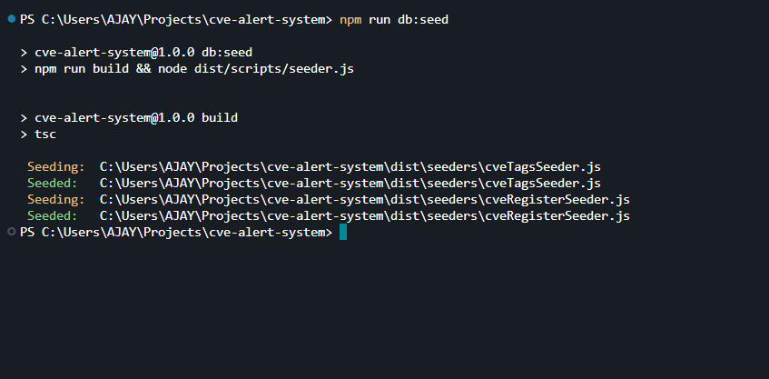

# CVE Alert System


## Overview

CVE Alert System is a comprehensive web application developed to notify users about vulnerabilities (CVEs) that could affect their registered websites and technologies. Users can register their websites and the associated technologies, and the system will automatically monitor for newly registered CVEs. Upon detecting a relevant CVE, the system generates an incident report and sends an alert to the user through a chatbot message.

This project was created during the Phases Hackathon 2024, where it secured second prize.

## Relevance

In today's digital landscape, security vulnerabilities pose a significant threat to websites and online services. The CVE Alert System addresses these challenges by providing:

- **Proactive Monitoring**: Continuous surveillance of newly registered CVEs to ensure timely detection of potential threats.
- **Automated Alerts**: Immediate notification to users via chatbot when a relevant CVE is identified, allowing for rapid response and mitigation.
- **Incident Management**: Creation of incident reports for detected vulnerabilities, helping users to track and address issues effectively.
- **Technology-Specific Insights**: Customizable monitoring based on the specific technologies used by registered websites, ensuring relevant and precise alerts.

By leveraging these features, the CVE Alert System helps organizations and individuals safeguard their digital assets against emerging vulnerabilities.


## Features

- CVE Monitoring: The system continuously monitors new CVE registrations.
- Incident Creation: Automatically creates an incident when a relevant CVE is detected.

## Technologies Used

- Frontend: HTML, CSS, JavaScript, JQuery
- Backend: TypeScript, Node.js, Express
- Database: MongoDB
- CVE Data Source: [CVE Data API/Source]

## Getting Started

### Prerequisites

- TypeScript
- Node.js
- MongoDB

### Installation

1. Clone the repository:
    ```bash
    git clone git@github.com:AjiMk/dashboard.git
    cd dashboard
    ```

2. Install the dependencies:
    ```bash
    npm install
    ```

3. Set up environment variables:
    - Create a `.env` file in the root directory
    - Add the following variables:
        ```plaintext
        PORT=<port>
        DB_URI=<your-mongodb-uri>
        CVE_DB_PATH=<cve db path>
        ```
4. Clone the CVE database
    ```bash
    git clone git@github.com:CVEProject/cvelistV5.git
    cd cves
    copy dir path and add under env variable `CVE_DB_PATH`
    ```
5. Seed all CVE records in MongoDB
    ```bash
    npm run db:seed
    ```
6. Start the application:
    ```bash
    npm run dev 
    ```


## Scripts

- `npm start`: Starts the application.
- `npm run dev`: Starts the application in development mode.
- `npm test`: Runs the test suite.
- `npm run build`: Builds the application for production.
- `npm run db:seed`: Seed data to db.

## Screenshots

### Dashboard


### Seeder



## Contributing

We welcome contributions! Please read our [Contributing Guidelines](CONTRIBUTING.md) for more details.

## License

This project is licensed under the MIT License. See the [LICENSE](LICENSE) file for details.

## Acknowledgements

- [CVE Data Source](https://github.com/CVEProject/cvelistV5)
- [Phases (Hackathon organizers)](https://www.phases.io/)

## Contact

For any questions or feedback, please reach out to ajaymeledath007@gmail.com or create an issue in this repository.

---

Built with ❤️ by Ajay Kumar M
