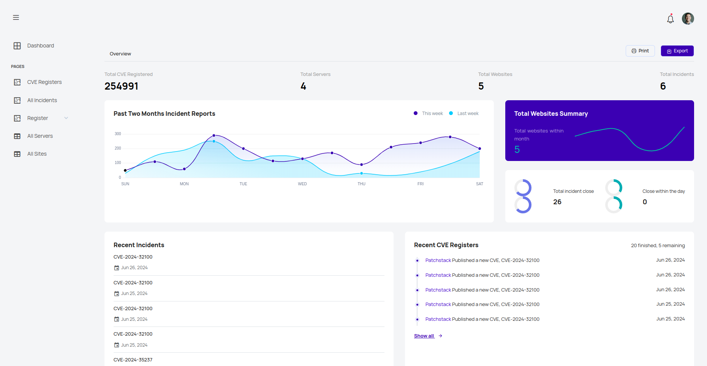

# CVE Alert System


## Overview

CVE Alert System is a full-stack web application designed to keep users informed about vulnerabilities (CVEs) that may impact their registered websites and technologies. By allowing users to register their websites and the technologies they use, the system automatically monitors newly registered CVEs. When a relevant CVE is detected, the system creates an incident and alerts the user via a chatbot message.

This project was built during a Phases-Hackathon-2024, where it won second prize.



## Features

- CVE Monitoring: The system continuously monitors new CVE registrations.
- Incident Creation: Automatically creates an incident when a relevant CVE is detected.

## Technologies Used

- Frontend: HTML, CSS, JavaScript, JQuery
- Backend: Typescript, Node.js, Express
- Database: MongoDB
- CVE Data Source: [CVE Data API/Source]

## Getting Started

### Prerequisites

- Typescript
- Node.js
- MongoDB

### Installation

1. Clone the repository:
    ```bash
    git clone git@github.com:AjiMk/dashboard.git
    cd dashboard
    ```

2. Install the dependencies:
    ```bash
    npm install
    ```

3. Set up environment variables:
    - Create a `.env` file in the root directory
    - Add the following variables:
        ```plaintext
        PORT=<port>
        DB_URI=<your-mongodb-uri>
        ```

4. Start the application:
    ```bash
    npm run dev 
    ```

### Usage

1. The site will point to dashboard
2. Register new servers
3. Enter the details of your website and the technologies used with the server.
4. The system will automatically monitors new CVE as it registred upon.
5. When a relevant CVE is detected, an incident will registred and and you will recive an alert via chatbot.

## TODO

- [ ] Add Login, Register functionalities
- [ ] Implement user roles and permissions
- [ ] Complete the Dashboard
- [ ] Enable Print, Export features from the dashboard
- [ ] Improve user interface and user experience
- [ ] Add categorized threat level like, low, medium, and high
- [ ] Add more chatbot integrations (e.g., Slack, Microsoft Teams)
- [ ] Enhance the incident reporting system with more detailed analytics
- [ ] Improve documentation and add examples
- [ ] Optimize performance and scalability

## Contributing

We welcome contributions! Please read our [Contributing Guidelines](CONTRIBUTING.md) for more details.

## License

This project is licensed under the MIT License. See the [LICENSE](LICENSE) file for details.

## Acknowledgements

- [CVE Data Source](https://github.com/CVEProject/cvelistV5)
- [Phases(Hackathon organizers)](https://www.phases.io/)

## Contact

For any questions or feedback, please reach out to ajaymeledath007@gmail.com or create an issue in this repository.

---

Built with ❤️ by Ajay Kumar M
